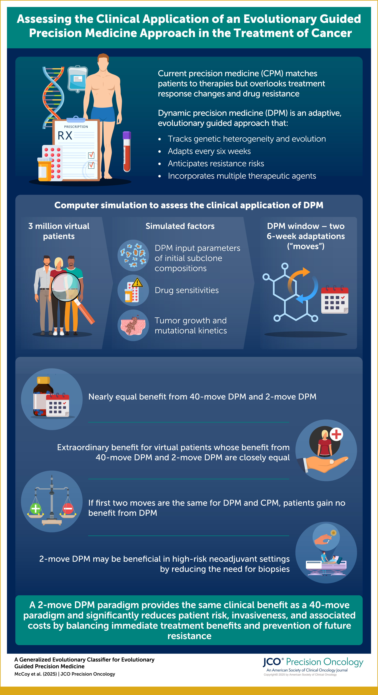

# A Generalized Evolutionary Classifier for Evolutionary Guided Precision Medicine

**Purpose**

Current precision medicine (CPM) matches patients to therapies using traditional biomarkers, but inevitably resistance develops. Dynamic precision medicine (DPM) is a new evolutionary guided precision medicine (EGPM) approach undergoing translational development. It tracks intratumoral genetic heterogeneity and evolutionary dynamics, adapts as frequently as every 6 weeks, plans proactively for future resistance development, and incorporates multiple therapeutic agents. Simulations indicated DPM can significantly improve long-term survival and cure rates in a cohort of 3 million virtual patients representing a variety of clinical scenarios. Given the cost and invasiveness of monitoring subclones frequently, we sought to determine the value of a short DPM window of only two 6-week adaptations (moves).

**Methods**

In a new simulation, nearly 3 million virtual patients, differing in DPM input parameters of initial subclone compositions, drug sensitivities, and growth and mutational kinetics, were simulated as previously described. Each virtual patient was treated with CPM, DPM, and DPM for two moves followed by CPM.

**Results**

The first two DPM moves provide similar average benefit to a 5-year, 40-move sequence in the full virtual population. If the first two moves are identical for DPM and CPM, patients will not benefit from DPM (65% negative predictive value). A patient subset (20%) in which 2-move DPM and 40-move DPM provide closely similar outcomes has extraordinary predicted benefit (hazard ratio of DPM/CPM 0.03).

**Conclusion**

The first two DPM moves provide most of the clinical benefit of DPM, reducing the duration required for subclone monitoring. This also leads to an evolutionary classifier selecting patients who will benefit: those in whom DPM and CPM recommendations differ early. These advances bring DPM (and potentially other EGPM approaches) closer to potential clinical testing.

[link to publication](https://ascopubs.org/doi/10.1200/PO.23.00714)

## Running Simulation Code
The code was originally developed to simulate DPM strategies presented [Impact of genetic dynamics and single-cell heterogeneity on development of nonstandard personalized medicine strategies for cancer](https://www.pnas.org/doi/10.1073/pnas.1203559109). 

It was adapted to simulate only three therapeutic strategies:
- CPM (Strategy 0 from Beckman et al.)
- DPM (Strategy 2.2 from Beckman et al.)
- DPM for 2 treatment windows, followed by CPM for the remainder of the treatment.

### 9 Input Parameters
Assuming an initial population of 5 x 10^9 total cells (5 cm^3 lesion)

- the ratio of the initial R1 and total populations were 0, 10^−9, 10−7, 10−5, 10−3, 0.1, and 0.9. 
  - The subpopulations vary from absent to only five cells; from four 2-log increments to 10%; and, finally, the case where they are the dominant population.
- the ratio of the initial R2 and total populations were 0, 10−9, 10−7, 10−5, 10−3, 0.1, and 0.9.
- the ratio of the initial R1 and total populations were 0, 10−9, 10−7, 10−5, 10−3, 0.1, and 0.9.
populations.
- a net growth rate (per day), g0, were 0.001, 0.002642, 0.00698, 0.018439, 0.048714, 0.128696 and 0.34.
  - The maximum value is a worst case scenario assuming a 48-h growth rate, 100% cells in cycle, and zero death rate. In contrast, the minimum value is a very slow-growing tumor that doubles in size over a 2-y period. The low range is roughly in accord with the range of growth rates that fit data from 228 patients with pancreatic cancer, 101 of whom also contributed autopsies (i.e., 0.005–0.02 per day). The intermediate values represent equal log increments. A value of 0.055 corresponds to a relatively fast-growing realistic tumor that doubles in size in the 6-wk interval between CT scans 
- the sensitivity of S to d1 relative to the natural growth rate were 0.000560, 0.005379, 0.051674, 0.496387, 4.768310, 45.804544, and 440.
  - The ratio is < 1 if S is resistant to d1. The minimum sensitivity of interest should be sufficient to cause a 25% increase in the progression-free survival (20% decrease in the instantaneous progression hazard) for the slowest growth rate tumor in the range listed above. That corresponds to the minimum effect size deemed of interest in clinical drug development programs. The maximum sensitivity was calculated to cause a 4-log decrease in cell count over 3 mo for the fastest growing tumor in the range listed above. The highest sensitivity to the growth rate ratio involved the highest sensitivity divided by the lowest growth rate. The lowest sensitivity to the growth rate ratio involved the lowest sensitivity divided by the highest growth rate. Between these extremes, the range was divided into equally spaced logarithmic intervals.
- The sensitivity of S to d2 over d1 were 0.000400, 0.001474, 0.005429, 0.020000, 0.073681, 0.271442, and 1. 
  - Here we assume that d1 is more effective than d2 against S cells. Because d1 is superior to d2 by convention, the highest possible value of this ratio is 1. The lowest possible value is the lowest sensitivity of interest divided by the highest sensitivity of interest. The range is divided into equally spaced logarithmic intervals. 
- The sensitivity of R1 to d1 over sensitivity of S to d1 were 0, 10−5, 9.564 × 10−5, 9.146 × 10−4, 8.747 ×10−3, 8.365 × 10−2, and 0.8. 
  - These were picked arbitrarily to include 0 (complete resistance), 1 × 10−5 (considerable resistance), and 0.8 (minimal resistance), with equal logarithmic spacing of other values between 1 × 10−5 and 0.8.
- The sensitivity of R2 to d2 over the sensitivity of S to d2 were 0, 10−5, 9.564 × 10−5, 9.146 × 10−4, 8.747 × 10−3, 8.365 × 10−2, and 0.8. 
  - These values are identical to those immediately above.
- The S→R1 transition rate (per cell division) were 10−11, 2.154 × 10−10, 4.642 × 10−9, 10−7, 2.154 × 10−6, 4.642 × 10−5, and 10−3. 
  - Transitions can occur by any known genetic or epigenetic mechanism, including mutations, translocations, insertions, deletions, translocations, amplifications, copy number change, DNA methylation, and/or modification of histones. The total transition rate is the sum of all possible transition rates over all relevant loci that alter the sensitivity/resistance phenotype. These loci may correspond to “driver” loci; however, in some cases, they correspond to “passenger” loci (i.e., some genetic changes, although not part of the original oncogenic mutations, may still drive resistance to therapy). The lowest transition rate value assumes the WT mutation rate estimated for human stem cells. It is in accord with a minimal mutation burden in the most genetically stable tumor, yet sequenced, retinoblastoma (minimum 2.2 × 10−8 burden in a full tumor, or 2.2 × 10−10 or less per generation if 100 or more cell generations to generate the retinoblastoma are assumed). The highest transition rate value assumes this rate initially, a maximal mutator mutation of 50,000-fold increase in mutation rate (8), and many parallel pathways to acquire resistance (100 proteins, mutation of which could lead to resistance, each with 20 possible loci for mutation). Note that a typical protein is at least 100 amino acids, and, on average, 30% of loci inactivate enzymes when there is a nonsynonymous mutation. This rate is also ∼10-fold the rate of genetic change per locus in cells with a chromosomal instability (CIN) mutation, allowing for 10 parallel pathways of resistance by CIN. The range of 10−11 to 10−3 thus encompasses a broad range of possible values. It is in accord with modeling of data from a series of 228 patients with pancreatic cancer, 101 of whom had autopsies. The best fit to this data was with a genetic change rate of 6 × 10−5, but all values within the range explored (10−9 to 10−4) had nearly equally good fits. The other values are at equally spaced logarithmic intervals.
- Possible values for an S → R2 mutation rate (per cell division) were 10−11, 2.154 × 10−10, 4.642 × 10−9, 10−7, 2.154 ×10−6, 4.642 × 10−5, and 10−3
.

### executing simulations
The [simulation code](https://github.com/GU-DPM/EvolutionaryClassifier/tree/main/simulation/DPM_simulation_code) is executed by running the following on the command line:

`> ./revisit_optimize_multidrug_responses_trimrates_strategies_index1 2 two_drug_argumentlist1.csv $i 10000 $resultsPath/param_ALLDRUG_ $resultsPath/stopt_ALLDRUG_ $resultsPath/dosage_ALLDRUG_ $resultsPath/pop_ALLDRUG_
`

The file two_drug_argumentlist1.csv contains the entire paramter space described above. The positional arguments relate to how that paramter space is sampled and how many simulations to run.

The code can be run in parallel using the bash scripts found in 
[the simulation directory](https://github.com/GU-DPM/EvolutionaryClassifier/blob/main/simulation/DPM_simulation_code/runDPM.1.sh)

## processing/aggregating results

### output files
Annotations of simulation outcome files.

- Simulation outcomes are stored in multiple files.
  - param_ALLDRUG_xxx.txt: parameter configuration values.
  - stopt_ALLDRUG_xxx.txt: survival times for each parameter configuration and each strategy.
  - dosage_ALLDRUG_xxx.txt: dosage combination sequences for each parameter configuration and each strategy.
  - pop_ALLDRUG_xxx.txt: population composition dynamics for each parameter configuration and each strategy.

##### param_ALLDRUG_xxx.txt format:
Each line denotes a parameter configuration with the following entries:
1) parameter configuration index (one entry).
2) initial population compositions x0 (four entries, x0(S), x0(R1), x0(R2), x0(R12)).
3) growth rate g0 (one entry).
4) drug sensitivity matrix Sa (eight entries, Sa(S,drug1), Sa(S,drug2), Sa(R1,drug1), Sa(R1,drug2), ...).
5) transition rate matrix T (sixteen entries, T(S->S), T(S->R1), T(S->R2), T(S->R12), T(R1->S), T(R1->R1), T(R1->R2), T(R1->R12), ....

##### stopt_ALLDRUG_xxx.txt format:
Each line denotes the survival times (stopping times) of 3 strategies for each parameter configuration.
1) strategy 0: strategy 0 in the PNAS paper.
2) strategy 1: strategy 2.2 in the PNAS paper.
3) strategy 2: strategy 2.2 in the PNAS paper for first two treatment decisions, followed by strategy 0 in the PNAS paper
  - Each line has 4 entries: parameter configuration index and the survival times of the 10 strategies.
  - The time horizon of the therapy is 1800 days.  Each period is 45 days.  If the patient is cured (the total tumor population = 0), then the survival time is reported as 1845 days.  If the survival time is 1800 days, then the tumor population size is greater than 0 and smaller than the mortal level (1e13).

##### dosage_ALLDRUG_xxx.txt format:
Each line denotes the dosage combination sequence of each strategy for each parameter configuration.
1) parameter configuration index.
2) strategy index (0-2).
3) (drug1 dosage,drug2 dosage) at t=0.
4) (drug1 dosage,drug2 dosage) at t=45.

...

42) (drug1 dosage,drug2 dosage) at t=1755.
- If t exceeds the survival time of the strategy, then the drug dosage is set to -1.

##### pop_ALLDRUG_xxx.txt format:
Each line denotes the population composition dynamics of each strategy for each parameter configuration.
1) parameter configuration index.
2) strategy index (0-9).
3) (S,R1,R1,R12) population size at t=45.
4) (S,R1,R1,R12) at t=90.

...

42) (S,R1,R1,R12) at t=1800.

If t exceeds the survival time of the strategy, then the population size is set to -1.

Notice the dosage combination is reported at the beginning of each period, and the population composition is reported at the end of each period.

[Zenodo archive](https://zenodo.org/records/12585250_)

### Processing the raw simultion output
https://github.com/GU-DPM/EvolutionaryClassifier/blob/main/simulation/results_preprocessing/map_input_params.py

add process all sim files notebook

map_parameters
generate all parameter 
"folded" input parameter 

map_trajectories

dosage trajectory
population trajectory

collect_EC_and_survival
EC catagory and survival days for all strategies
days improvement

## analysis
google bigquery

survival less than 4 years on DPM,       AND sp.S_cell_sensitivity_D1 > 0.2 * sp.g0
      AND sp.S_cell_sensitivity_D2 > 0.2 * sp.g0
      AND sp.R12_cell_sensitivity_D1 < sp.g0
      AND sp.R12_cell_sensitivity_D2 < sp.g0

https://github.com/GU-DPM/EvolutionaryClassifier/blob/main/analysis/EC_survival_and_params.zip

population subset analysis

indiviual patient analysis

analyze_2_move

## archive
This is a spot for legacy code that has been replace by updated methods and is NOT maintained.
